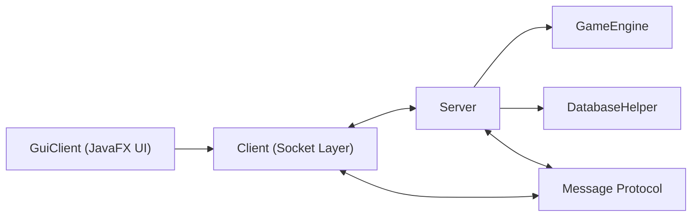

# Checkers2088

<div align="center">

**A networked JavaFX checkers game with real-time matchmaking, server-authoritative rules, and persistent player stats.**


</div>

## Overview

Checkers2088 is a full-stack Java project built around a clean client/server split. The JavaFX client handles presentation, scene flow, board rendering, and user input. The server handles matchmaking, chat routing, active game sessions, move validation, rematches, and persistent player records.

The result is a multiplayer board game that feels closer to a polished application than a classroom prototype. The project combines UI design, socket programming, concurrency, game rules, and database persistence in one cohesive system.

## Highlights

- Real-time multiplayer over Java sockets
- Server-authoritative gameplay with forced jumps, multi-jumps, and kinging
- Premium JavaFX interface with custom board rendering and neon styling
- Queue-based matchmaking and private match chat
- SQLite-backed wins, losses, and leaderboard updates
- Standalone client and server modules that build independently

## Tech Stack

| Layer | Technology |
| --- | --- |
| Language | Java 17 |
| UI | JavaFX |
| Build | Maven |
| Networking | `java.net.Socket`, `ServerSocket`, object streams |
| Persistence | SQLite with JDBC |
| Testing | JUnit 5 |

## Architecture



### Core responsibilities

- `GuiClient` builds the login, instructions, arena, and game-over scenes.
- `Client` owns the socket connection and background read loop.
- `Server` manages logins, queueing, chat, rematches, and match sessions.
- `GameEngine` owns all legal-move validation and board progression.
- `DatabaseHelper` stores and reads player win/loss records.
- `Message` is the serializable DTO shared across the client/server boundary.

## Gameplay Features

### Multiplayer flow

- Unique username login
- Global lobby chat
- Private match chat
- Join/leave matchmaking queue
- Automatic pairing into Ruby vs Onyx matches
- Rematch requests from the game-over screen

### Rules engine

- Forced jumps are enforced server-side
- Multi-jump chains keep the turn active until the sequence ends
- Pieces promote immediately on the back row
- Winner detection checks both remaining pieces and available legal moves

### UI polish

- Native JavaFX board rendering with `StackPane`, `GridPane`, `Circle`, and `Text`
- Pulsing title and scene fade transitions
- Custom neon badge/logo built without external image assets
- Board flips for the Onyx side so each player sees their pieces from the bottom

## Project Structure

```text
Checkers2088/
├── checkers-client/
│   ├── pom.xml
│   └── src/main/
│       ├── java/checkers2088/client/
│       ├── java/checkers2088/shared/
│       └── resources/styles/
├── checkers-server/
│   ├── pom.xml
│   └── src/
│       ├── main/java/checkers2088/server/
│       ├── main/java/checkers2088/shared/
│       └── test/java/checkers2088/server/
└── pom.xml
```

## Running the Project

### Start the server

```powershell
cd checkers-server
mvn clean compile exec:java
```

The server starts on `127.0.0.1:5555`.

### Start a client

```powershell
cd checkers-client
mvn clean compile exec:java
```

For a local test, launch two client windows and connect both to `127.0.0.1` with different usernames.

## Local Test Flow

1. Start the server.
2. Start two clients.
3. Log in with two different usernames.
4. Click `Join Queue` on both.
5. The first player is assigned `RUBY`.
6. The second player is assigned `ONYX`.
7. Play the match and verify game-over and rematch flow.

## Persistence

The server creates a local SQLite database named `checkers-2088.db`.

Stored data:

- `username`
- `wins`
- `losses`

When a match ends, the server records the result immediately and sends refreshed stats and leaderboard text back to both clients so the communications panel stays current.

## Build and Test

Both modules are standalone:

```powershell
cd checkers-client
mvn clean compile

cd ../checkers-server
mvn clean compile
mvn test
```

## Why This Project Matters

This project demonstrates more than just gameplay logic. It shows the ability to design and ship a small distributed system with a custom UI, synchronized state, concurrency concerns, persistent storage, and a presentation layer polished enough for an end user.

It is also structured to be easy to explain in a code review or technical interview because the responsibilities are intentionally separated between UI, networking, rules, and persistence.

## Future Extensions

- AI practice mode
- Expanded player profiles and stats
- Friend list / social features
- Blitz timers
- Additional visual themes
